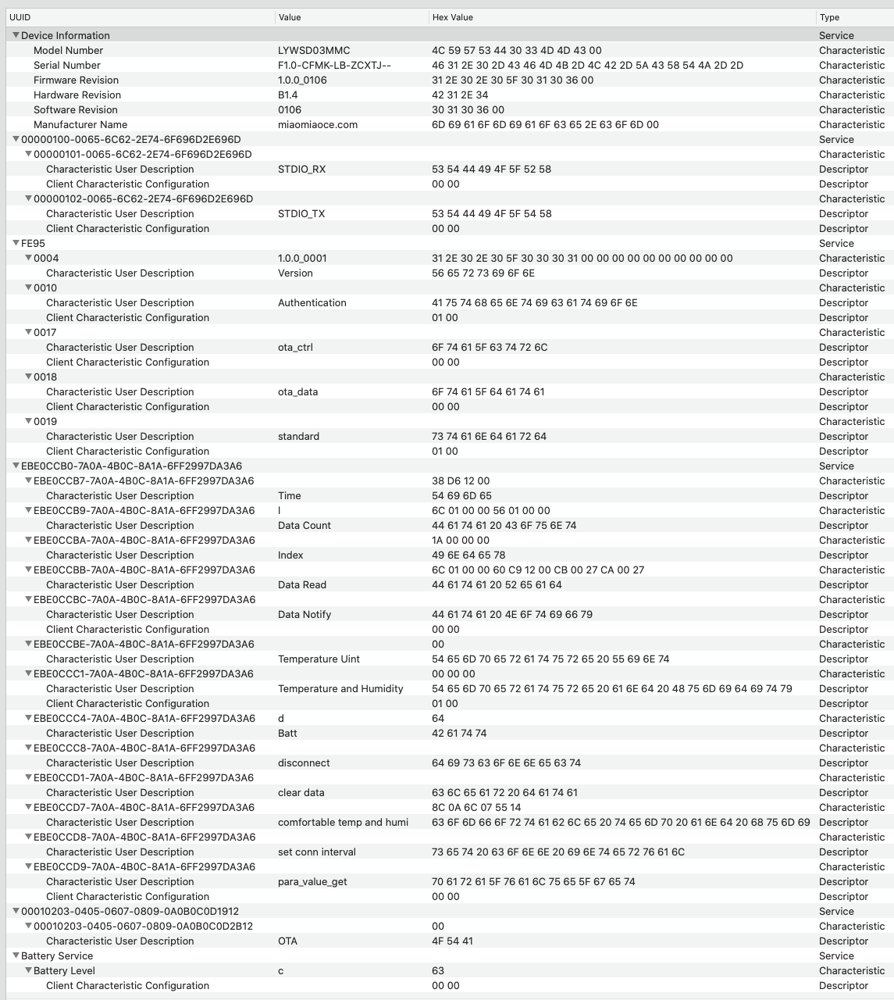

# LYWSD03MMC-info

TLSR8251 SoC, LYWSD03MMC [firmware here](https://github.com/custom-components/sensor.mitemp_bt/issues/7#issuecomment-570829260)

Advertisements payload example ([more](https://github.com/custom-components/sensor.mitemp_bt/issues/7#issuecomment-568723038), [raw hcidump](https://github.com/custom-components/sensor.mitemp_bt/issues/7#issuecomment-566897865), [filtered esp32log](https://github.com/custom-components/sensor.mitemp_bt/issues/7#issuecomment-573395064)):
```
 Xiaomi  payload   Sensor    packet        MAC                                                  RSSI
  UUID    type?     type        №

 95 FE     30      58 5B 05    89    C7 A8 D9 38 C1 A4    08                                     D5
 95 FE     58      58 5B 05    8A    C7 A8 D9 38 C1 A4    09 5B 0A 2C 11 00 00 00 BA D7 8D 0F    D1
 95 FE     30      58 5B 05    8B    C7 A8 D9 38 C1 A4    08                                     C2
 95 FE     58      58 5B 05    8C    C7 A8 D9 38 C1 A4    D9 2D 5F 24 A5 00 00 00 AE 9A 85 DD    D4
 95 FE     30      58 5B 05    8D    C7 A8 D9 38 C1 A4    08                                     CF
 95 FE     58      58 5B 05    8E    C7 A8 D9 38 C1 A4    25 B9 74 08 9D 00 00 00 11 F6 41 5C    CF
 95 FE     30      58 5B 05    8F    C7 A8 D9 38 C1 A4    08                                     CE
 95 FE     58      58 5B 05    90    C7 A8 D9 38 C1 A4    2D E3 2D 7B 49 00 00 00 EF 49 D6 2E    CE
 95 FE     30      58 5B 05    91    C7 A8 D9 38 C1 A4    08                                     CE
 95 FE     58      58 5B 05    92    C7 A8 D9 38 C1 A4    43 56 E2 51 BB 00 00 00 AC 12 98 1A    D4
 95 FE     30      58 5B 05    93    C7 A8 D9 38 C1 A4    08                                     D3
 95 FE     58      58 5B 05    94    C7 A8 D9 38 C1 A4    2F 8B 5F 69 02 00 00 00 2F 91 41 B7    D4
 95 FE     30      58 5B 05    95    C7 A8 D9 38 C1 A4    08                                     D7
```

Characteristics snapshot:


some HTTPS API responses:
```json
{"mac":"A4:C1:38:AB:DD:EB","model":"miaomiaoce.sensor_ht.t2","token":"12byteshex","did":"blt.3.11usobjecls00"}
{"did":"blt.3.11usobjecls00","token":"another12bytes","props":[{"type":"prop","key":"bind_key","value":"16bytes"},{"type":"prop","key":"smac","value":"A4:C1:38:AB:DD:EB"}]}
```
